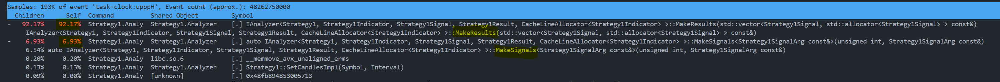

# Strategy1.Analyzer

OHLCV 캔들 데이터 기반 매매 전략의 GridSearch 백테스팅 프레임워크

## 개요

Strategy1.Core를 기반으로 구축된 전략 분석 도구. 멀티스레드 GridSearch를 통한 파라미터 최적화와 백테스팅을 지원.

## 핵심 컴포넌트

### 전략 구현 (IAnalyzer)

Strategy1.Core의 `IAnalyzer` 인터페이스를 구현하여 전략을 정의.
```cpp
class Strategy1 : public IAnalyzer
    Strategy1, 
    Strategy1Indicator, 
    Strategy1Signal, 
    Strategy1Result, 
    CacheLineAllocator<Strategy1Indicator>
> {
    using IAnalyzerImpl = std::true_type;
    
    // 필수 구현
    u32 GetCandleSizeImpl() noexcept;
    void SetCandlesImpl(Symbol symbol, Interval interval) noexcept;
    Strategy1Indicator MakeIndicator(u32 index, const Strategy1IndicatorArg& arg) noexcept;
    Strategy1Signal MakeSignal(u32 index, const Strategy1SignalArg& arg) noexcept;
    Strategy1Result MakeResult(const Strategy1Signal& signal) noexcept;
};
```

### 데이터 구조체 정의

Base 구조체를 상속하여 전략별 타입 정의:
```cpp
// 지표
struct Strategy1Indicator : BaseIndicator {
    Decimal<4> EMA1;
    Decimal<4> EMA2;
    Decimal<4> EMA3;
    Decimal<4> EMA4;
};

// 신호
struct Strategy1Signal : BaseSignal<2> {
    // CandleIndex, Position, TakeProfitPrice, LosscutPrice 상속
};

// 결과
struct Strategy1Result : BaseResult<2> {
    // StartCandleIndex, EndCandleIndex, EnterPrice, ExitPrice, ExpectedProfit 상속
};

// 파라미터
struct Strategy1IndicatorArg {
    Decimal<4> KValue1, KValue2, KValue3, KValue4;
    u32 Period1, Period2, Period3, Period4;
};

struct Strategy1SignalArg {
    Decimal<2> coeff1, coeff2, coeff3, coeff4;
};

// 분석 결과
using Strategy1AnalyzeResult = AnalyzeResult<Strategy1SignalArg>;
```

### Grid 구현 (IGrid)

GridSearch를 위한 파라미터 조합 생성:
```cpp
class Strategy1SignalGridImpl : public IGrid<Strategy1SignalGridImpl, Strategy1SignalArg> {
    using GridImpl = std::true_type;
    using Base::ArgType;
    
    SignalGrid grid;
    
    u32 GetCombinationCountImpl() const noexcept;
    std::vector<Strategy1SignalArg> GenerateCombinationsImpl() const noexcept;
};

struct SignalGrid {
    std::vector<Decimal<2>> coeff1Range;
    std::vector<Decimal<2>> coeff2Range;
    std::vector<Decimal<2>> coeff3Range;
    std::vector<Decimal<2>> coeff4Range;
};
```

### GridAnalyzeRunner

멀티스레드 GridSearch 실행 엔진:
```cpp
template<StrategyType Strategy, typename IndicatorArg, typename SignalArg, 
         GridType GridImpl, ResultBase AnalyzeResult>
class GridAnalyzeRunner {
    void SetCandles(Symbol symbol, Interval interval) noexcept;
    void SetIndicators(IndicatorArg arg) noexcept;
    void Run() noexcept;
};
```

**동작 방식:**
1. 파라미터 조합을 CORE_COUNT 개의 청크로 분할
2. 각 청크를 별도 스레드에서 병렬 처리
3. 각 스레드는 top N 결과 수집
4. 전체 결과를 병합하여 최종 top N 선정

## 사용 예시

### 기본 사용법
```cpp
#include "AnalyzeRunner.h"
#include "SignalGridImpl.h"
#include "Strategy1.h"

int main() {
    using AnalyzeRunner = GridAnalyzeRunner
        Strategy1, 
        Strategy1IndicatorArg, 
        Strategy1SignalArg, 
        Strategy1SignalGridImpl, 
        Strategy1AnalyzeResult
    >;
    
    // Grid 범위 설정
    SignalGrid signalGrid{
        .coeff1Range = GridSearch::MakeRange(Decimal<2>{5}, Decimal<2>{10}, Decimal<2>{1}),
        .coeff2Range = GridSearch::MakeRange(Decimal<2>{5}, Decimal<2>{10}, Decimal<2>{1}),
        .coeff3Range = GridSearch::MakeRange(Decimal<2>{5}, Decimal<2>{10}, Decimal<2>{1}),
        .coeff4Range = GridSearch::MakeRange(Decimal<2>{5}, Decimal<2>{10}, Decimal<2>{1})
    };
    
    Strategy1SignalGridImpl gridImpl(std::move(signalGrid));
    
    // Runner 실행
    AnalyzeRunner runner(std::move(gridImpl));
    runner.SetCandles(Symbol::ETHUSDT, Interval::FiveMinutes);
    runner.SetIndicators(targetIndicatorArgs);
    runner.Run();
}
```

### 전략 구현 단계

1. **데이터 구조체 정의** - Base 구조체 상속
2. **IAnalyzer 구현** - 5개 메서드 구현
3. **IGrid 구현** - 파라미터 조합 생성
4. **GridAnalyzeRunner 실행** - 멀티스레드 최적화

---

# 개선할 수 있는 점



위 perf 분석 이미지에서 알 수 있다시피 거의 대부분의 CPU가 MakeResults에 소모되고, 그 다음 MakeSignals에 소모된다.
이는 Indicator와 Signal 생성 규칙에 따라 약간씩 바뀔 수 있겠지만, MakeResults에 절대적인 시간이 들어간다는 점은 명백하게 알 수 있다.
따라서 개선할 수 있는 최적화 지점을 아래와 같이 제안할 수 있다.

1. **CUDA 병렬화**
   - MakeResults는 (StartIndex, TakeProfit, StopLoss)가 주어진 상태에서 (EndIndex, ExpectedProfit)을 구하는 과정
   - 각 Signal의 StartIndex, TP, SL은 서로 독립적
   - 모든 Signal이 단일 Candles 벡터를 읽기 전용으로 공유
   - 따라서 수십만 개의 Signal을 GPU의 수만 개 코어로 동시 처리 가능
2. **루프 언롤링 및 SIMD 최적화**
   - 하나의 Signal이 매우 적은 캔들 내에 close되지는 않는다는 경험적 근거에 의거해, 컴파일타임 상수만큼 루프 언롤링 실시
   - SIMD 벡터화: 한 번에 4~8개의 Candle High/Low 값을 동시에 TP/SL과 비교
   - 연속된 메모리 블록을 한 번에 로드
   - SIMD 마스크로 TP/SL 도달 즉시 감지하여 불필요한 반복 제거
